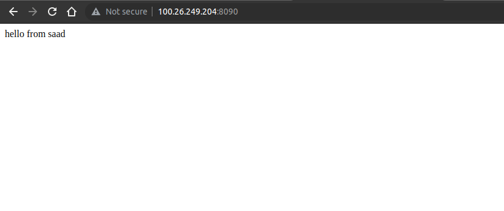
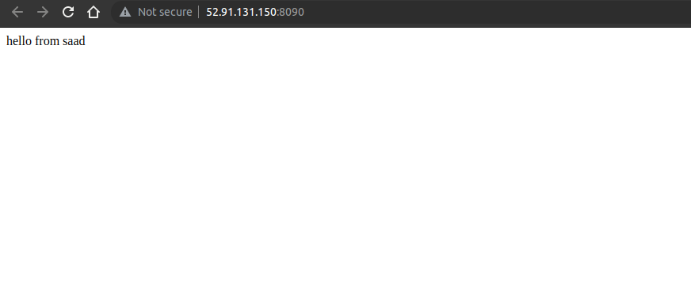

## Task1
create 2 machines:
- install apache2
- change port from 80 to 8090
- create custom page

## result
1. webserver 1

2. webserver 2


## tree
```
lab1/
├── ansible.pem
├── index.html
├── inventory.txt
├── pics
│   └── Screenshot from 2023-02-10 15-29-17.png
├── playbook.yaml
├── ports.conf
└── README.md
```

