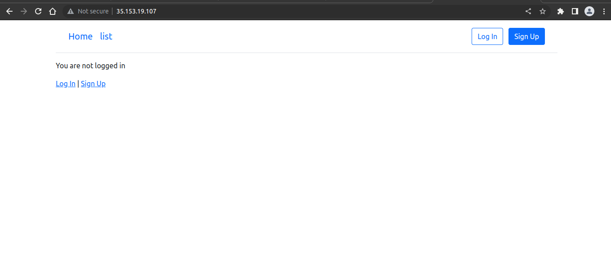
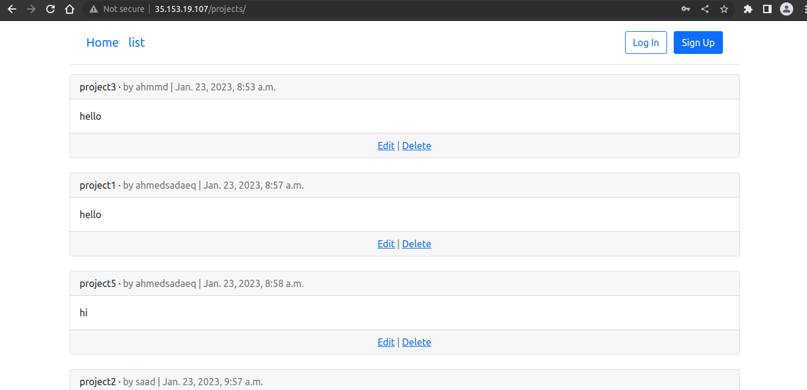

# Task2
Deploy your Django app on apache server


## app repo 
[django_project](https://github.com/ahmedsaadx/django-project)

## Prerequisites
You should also have Ansible installed on your system.

## result
1. 

2. 



## tree
```
lab2/
├── ansible.pem
├── apache2.conf
├── django.conf
├── invertory.txt
├── pics
│   ├── pic1.png
│   └── pic2.png
├── playbook.yaml
├── project
│   ├── accounts
│   │   ├── admin.py
│   │   ├── apps.py
│   │   ├── backends.py
│   │   ├── forms.py
│   │   ├── __init__.py
│   │   ├── migrations
│   │   │   ├── 0001_initial.py
│   │   │   ├── 0002_alter_customuser_email.py
│   │   │   ├── __init__.py
│   │   │   └── __pycache__
│   │   │       ├── 0001_initial.cpython-310.pyc
│   │   │       ├── 0002_alter_customuser_email.cpython-310.pyc
│   │   │       └── __init__.cpython-310.pyc
│   │   ├── models.py
│   │   ├── __pycache__
│   │   │   ├── admin.cpython-310.pyc
│   │   │   ├── apps.cpython-310.pyc
│   │   │   ├── backends.cpython-310.pyc
│   │   │   ├── forms.cpython-310.pyc
│   │   │   ├── __init__.cpython-310.pyc
│   │   │   ├── models.cpython-310.pyc
│   │   │   ├── urls.cpython-310.pyc
│   │   │   └── views.cpython-310.pyc
│   │   ├── tests.py
│   │   ├── urls.py
│   │   └── views.py
│   ├── db.sqlite3
│   ├── manage.py
│   ├── pages
│   │   ├── admin.py
│   │   ├── apps.py
│   │   ├── __init__.py
│   │   ├── migrations
│   │   │   ├── __init__.py
│   │   │   └── __pycache__
│   │   │       └── __init__.cpython-310.pyc
│   │   ├── models.py
│   │   ├── __pycache__
│   │   │   ├── admin.cpython-310.pyc
│   │   │   ├── apps.cpython-310.pyc
│   │   │   ├── __init__.cpython-310.pyc
│   │   │   ├── models.cpython-310.pyc
│   │   │   ├── urls.cpython-310.pyc
│   │   │   └── views.cpython-310.pyc
│   │   ├── tests.py
│   │   ├── urls.py
│   │   └── views.py
│   ├── project
│   │   ├── asgi.py
│   │   ├── __init__.py
│   │   ├── __pycache__
│   │   │   ├── __init__.cpython-310.pyc
│   │   │   ├── settings.cpython-310.pyc
│   │   │   ├── urls.cpython-310.pyc
│   │   │   └── wsgi.cpython-310.pyc
│   │   ├── settings.py
│   │   ├── urls.py
│   │   └── wsgi.py
│   ├── projects
│   │   ├── admin.py
│   │   ├── apps.py
│   │   ├── __init__.py
│   │   ├── migrations
│   │   │   ├── 0001_initial.py
│   │   │   ├── __init__.py
│   │   │   └── __pycache__
│   │   │       ├── 0001_initial.cpython-310.pyc
│   │   │       └── __init__.cpython-310.pyc
│   │   ├── models.py
│   │   ├── __pycache__
│   │   │   ├── admin.cpython-310.pyc
│   │   │   ├── apps.cpython-310.pyc
│   │   │   ├── __init__.cpython-310.pyc
│   │   │   ├── models.cpython-310.pyc
│   │   │   ├── urls.cpython-310.pyc
│   │   │   └── views.cpython-310.pyc
│   │   ├── tests.py
│   │   ├── urls.py
│   │   └── views.py
│   ├── requirements.txt
│   └── templates
│       ├── article_delete.html
│       ├── article_detail.html
│       ├── article_edit.html
│       ├── article_list.html
│       ├── article_new.html
│       ├── base.html
│       ├── home.html
│       └── registration
│           ├── login.html
│           ├── password_change_done.html
│           ├── password_change_form.html
│           └── signup.html
├── README.md
└── script.sh
```
