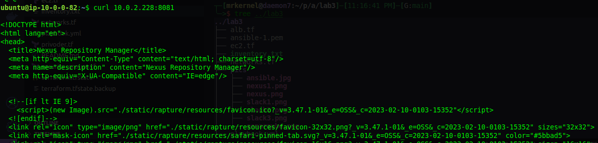
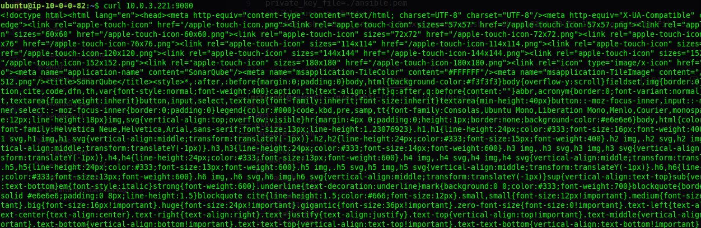
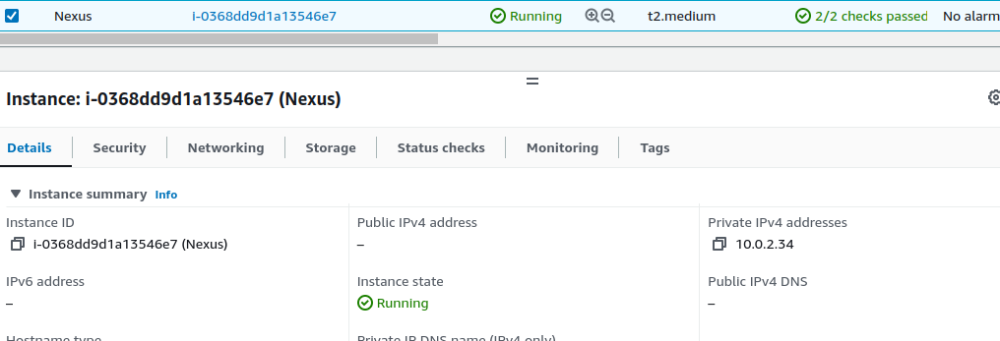
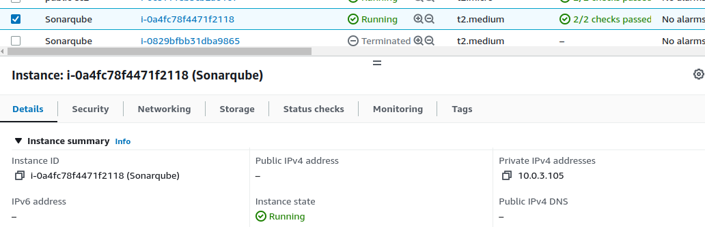
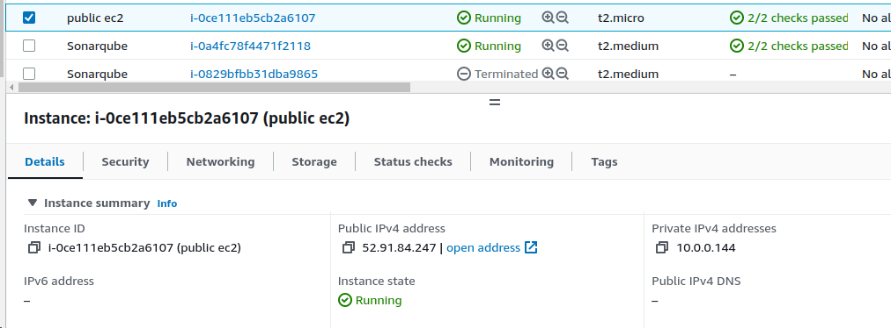

## Infrastructure as Code (IaC) using Terraform and ansible integration with slack
1.Dynamically create an inventory: Use the Terraform state file to generate a dynamic      inventory file that can be used by Ansible. This eliminates the need to manually create and manage inventory files, making the process more efficient and less error-prone.

2.Integrate with Slack: Set up Slack notifications to get notified of any infrastructure    
  successful installation with ansible

## diagram 


## Requirements
1. terraform
2. ansible 
3. slack account

## roles 
The following roles are available in this repository:
- Nexus Role : install and configures Nexus server on ubuntu hosts
  
- SonarQube Role: install and configures SonarQube server on ubuntu hosts , also copies a custom configuration files to host 
   
- Nginx Role : install and configures Nginx web server , also copies custom proxy config file to hosts

## Usage
```
terraform init
terraform apply
source scripts/bash.sh #>>>> bash shell (run per session)
source scripts/fish.sh # >>>> fish shell (run per session)
ansible-playbook playbook.yaml -i inventory.txt
```


## result
- nexus from public alb
    
- nexus from public alb 2
    
- sonar from public alb 
    
- slack 1
    
- slack 2
    
- slack 3
    
- curl nexus from bastion
    
- curl sonar from bastion
    
- nexus ec2 
        
- sonar ec2 
    
- public ec2 
        

## tree
```
../lab3
├── alb.tf
├── ansible-1.pem
├── ec2.tf
├── inventory.txt
├── networks.tf
├── pics
│   ├── ansible.jpg
│   ├── nexus1.png
│   ├── nexus.png
│   ├── slack1.png
│   ├── slack2.png
│   ├── slack3.png
│   └── sonarqube.png
├── playbook.yml
├── privoder.tf
├── README.md
├── roles
│   ├── Nexus
│   │   ├── defaults
│   │   │   └── main.yml
│   │   ├── files
│   │   │   └── nexus.service
│   │   ├── handlers
│   │   │   └── main.yml
│   │   ├── meta
│   │   │   └── main.yml
│   │   ├── README.md
│   │   ├── tasks
│   │   │   └── main.yml
│   │   └── vars
│   │       └── main.yml
│   ├── Nginx
│   │   ├── defaults
│   │   │   └── main.yml
│   │   ├── handlers
│   │   │   └── main.yml
│   │   ├── meta
│   │   │   └── main.yml
│   │   ├── README.md
│   │   ├── tasks
│   │   │   ├── default
│   │   │   └── main.yml
│   │   ├── tests
│   │   │   ├── inventory
│   │   │   └── test.yml
│   │   └── vars
│   │       └── main.yml
│   └── sonarqube-role
│       ├── defaults
│       │   └── main.yml
│       ├── handlers
│       │   └── main.yml
│       ├── meta
│       │   └── main.yml
│       ├── README.md
│       ├── tasks
│       │   ├── main.yml
│       │   ├── sonar.properties
│       │   └── sonar.service
│       ├── tests
│       │   ├── inventory
│       │   └── test.yml
│       └── vars
│           └── main.yml
├── scripts
│   ├── bash.sh
│   └── fish.sh
├── security_groups.tf
├── terraform.tfstate
└── terraform.tfstate.backup
```


